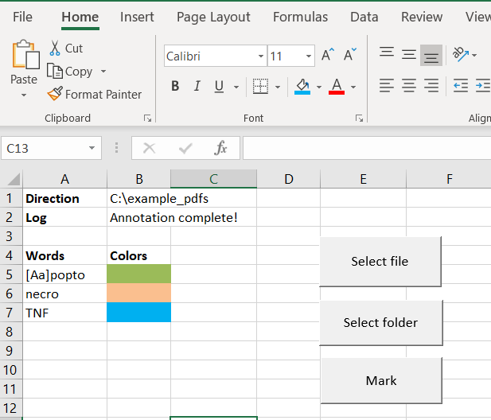

# pdf_tools
Different tools for work with pdf files

## pdf_highlight
This is a python tool for highlighting different words with different color in a pdf file with simple UI in an Excel file. 
Requires Xlwings addin installed on Excel (for more information how to install Xlwings library and addin please check 
 [Xlwings documentation](https://docs.xlwings.org/en/stable/addin.html).
 Requires xlwings, pdfminer and PyPDF2 python packages
 
 #### How to use:
1. Click on "Select file" or "Select folder" button (depending if you want to highlight single pdf file or many pdf files in a folder)
This will open Select file/ Select folder window and you should browse to the file/folder to be highlighted. The full path to the file/folder will be shown in cell B2
2. Choose Words to be highlighted in the cells A5:A(n). This tool is case sensitive so if word "Something" is in cell A5 this is not going to highlight word "something" in the text but only word "Something". 
This tool is accepting regular expressions in the Words, so if you want both "Something" and "something" to be highlighted in the pdf file you should put "[Ss]omething" in the Words column.
3. Choose Fill colors in the cells B5:B(n). If no color is chosen for a given word a random color will be assigned.
4. Click on the Mark button, the B2 cell will show the progress of the job and the highlighted pdf files will be saved as a copies in the same folder as the 
originals and with the same name extended with "_highlighted" tag.

